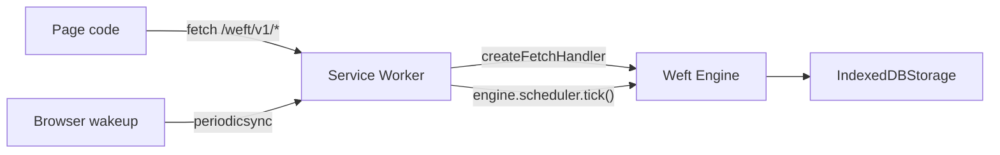

# Service Worker

Weft can run a browser-local engine behind a Service Worker. The page talks to the engine through the same HTTP shape it would use for a remote Weft server, but requests under a path like `/weft/` are intercepted locally and backed by `IndexedDB`.

This guide documents the current public surface: `Engine`, `IndexedDBStorage`, `createFetchHandler()`, `createLifecycleHandlers()`, `createPeriodicSyncHandler()`, browser Service Worker registration, manual Periodic Background Sync registration, and `engine.scheduler.tick()` for timer wakeup.

## Mental model

In server mode, a long-lived Bun process owns the engine, storage, HTTP routes, and timer scheduler. In browser mode, the Service Worker owns those same responsibilities within the limits of the browser runtime.



The Service Worker is the browser-side request owner. It intercepts requests, delegates matching ones to Weft, and lets unrelated requests continue to the network.

## Service Worker file

Create a Service Worker module that constructs the engine, registers browser-safe activities and workflows, recovers persisted work, and wires fetch plus timer events.

```typescript partial
/// <reference lib="webworker" />

import { Engine, activity } from 'weft';
import { IndexedDBStorage } from 'weft/storage/indexeddb';
import {
  createFetchHandler,
  createLifecycleHandlers,
  createPeriodicSyncHandler,
} from 'weft/service-worker';

const serviceWorker = self as unknown as ServiceWorkerGlobalScope;

const storage = new IndexedDBStorage('weft');
const engine = new Engine({ storage });

const formatGreeting = activity({
  name: 'formatGreeting',
  execute: async (input: { name: string }) => `Hello, ${input.name}!`,
});

engine.registerActivity(formatGreeting.name, formatGreeting);

engine.register('welcome', async function* (ctx, input: { name: string }) {
  const greeting = yield* ctx.run(formatGreeting, { name: input.name });
  yield* ctx.sleep('5s');
  return { greeting };
});

await engine.recoverAll();

const { install, activate } = createLifecycleHandlers();
serviceWorker.addEventListener('install', install);
serviceWorker.addEventListener('activate', activate);
serviceWorker.addEventListener('fetch', createFetchHandler({ engine, pathPrefix: '/weft/' }));

serviceWorker.addEventListener('periodicsync', createPeriodicSyncHandler(engine.scheduler));

serviceWorker.addEventListener('message', (event) => {
  if (event.data?.type !== 'weft:tick') return;
  event.waitUntil(engine.scheduler.tick());
});
```

The important pieces are:

- **`IndexedDBStorage`:** Durable browser storage for checkpoints, workflow state, signals, and timers.
- **`createFetchHandler()`:** Intercepts `/weft/` requests and strips the prefix before routing to Weft's `/v1/*` handler.
- **`createPeriodicSyncHandler()`:** Returns a `periodicsync` listener for the `weft-timers` tag and calls `engine.scheduler.tick()` inside `event.waitUntil(...)`.
- **`engine.recoverAll()`:** Lets a newly started Service Worker resume workflows already stored as running. Await it before serving steady-state fetch traffic so recovery failures are visible instead of silently leaving workflows parked.
- **`engine.scheduler.tick()`:** Scans durable timer keys and advances expired sleeps.

## Page registration

Register the Service Worker from page code, wait until it is ready, register Periodic Background Sync when available, then use the HTTP client against the local path prefix.

```typescript partial
import { HttpClient } from 'weft/client';

const registration = await navigator.serviceWorker.register('/sw.js', {
  scope: '/',
  type: 'module',
});

await navigator.serviceWorker.ready;

type PeriodicSyncRegistration = ServiceWorkerRegistration & {
  periodicSync: {
    register(tag: string, options: { minInterval: number }): Promise<void>;
  };
};

function hasPeriodicSync(
  registration: ServiceWorkerRegistration,
): registration is PeriodicSyncRegistration {
  return 'periodicSync' in registration;
}

async function registerWeftPeriodicSync(registration: ServiceWorkerRegistration): Promise<boolean> {
  if (!hasPeriodicSync(registration)) return false;

  const permission = await navigator.permissions
    .query({ name: 'periodic-background-sync' as PermissionName })
    .catch(() => undefined);

  if (permission?.state === 'denied') return false;

  try {
    await registration.periodicSync.register('weft-timers', {
      minInterval: 60_000,
    });
    return true;
  } catch {
    return false;
  }
}

const periodicSyncRegistered = await registerWeftPeriodicSync(registration);

if (!periodicSyncRegistered) {
  const tickWeft = () => registration.active?.postMessage({ type: 'weft:tick' });
  window.setInterval(tickWeft, 60_000);
  document.addEventListener('visibilitychange', () => {
    if (document.visibilityState === 'visible') tickWeft();
  });
}

const client = new HttpClient({ baseUrl: '/weft' });
const workflowInput = { name: 'Ada' };
const handle = await client.start('welcome', workflowInput, { id: 'welcome:ada' });
const result = await handle.result();
```

`HttpClient` appends `/v1/*` to the `baseUrl`, so `baseUrl: '/weft'` sends workflow starts to `/weft/v1/workflows`. The Service Worker strips `/weft/`, and the engine sees `/v1/workflows`.

## Timer wakeup

`ctx.sleep()` persists timer records in IndexedDB. A sleeping workflow does not advance until something wakes the Service Worker and calls `engine.scheduler.tick()`.

Periodic Background Sync is the best browser primitive for this job when available, but registration can be unavailable, denied, or rejected by the browser. Use the helper above and fall back when it returns `false`.

```typescript partial
const registration = await navigator.serviceWorker.ready;

const periodicSyncRegistered = await registerWeftPeriodicSync(registration);

if (!periodicSyncRegistered) {
  const tickWeft = () => registration.active?.postMessage({ type: 'weft:tick' });
  window.setInterval(tickWeft, 60_000);
}
```

The helper checks support, checks permission when the browser exposes that status, and catches registration failures. The Service Worker listens for the matching tag. The exported `createPeriodicSyncHandler()` helper is the shortest way to wire that listener:

```typescript partial
serviceWorker.addEventListener('periodicsync', createPeriodicSyncHandler(engine.scheduler));
```

The manual listener is equivalent and shows the underlying wakeup path:

```typescript partial
serviceWorker.addEventListener('periodicsync', (event) => {
  if (event.tag !== 'weft-timers') return;
  event.waitUntil(engine.scheduler.tick());
});
```

When Periodic Background Sync is unavailable, page-driven polling is the fallback. This only runs while a controlled tab is open.

```typescript partial
const tickWeft = () => {
  registration.active?.postMessage({ type: 'weft:tick' });
};

window.setInterval(tickWeft, 60_000);
document.addEventListener('visibilitychange', () => {
  if (document.visibilityState === 'visible') tickWeft();
});
```

The Service Worker receives that message and runs the same scheduler tick:

```typescript partial
serviceWorker.addEventListener('message', (event) => {
  if (event.data?.type !== 'weft:tick') return;
  event.waitUntil(engine.scheduler.tick());
});
```

## Browser support

As of May 4, 2026:

- [MDN marks Periodic Background Sync](https://developer.mozilla.org/en-US/docs/Web/API/Web_Periodic_Background_Synchronization_API) as experimental and limited availability.
- [web.dev lists Periodic Background Sync](https://web.dev/patterns/web-apps/periodic-background-sync) as supported in Chrome and Edge, but not Firefox or Safari.
- [MDN documents Service Workers](https://developer.mozilla.org/en-US/docs/Web/API/Service_Worker_API) as secure-context APIs: production pages need HTTPS, while `http://localhost` is treated as secure for local development.

Design browser workflows as opportunistic local durability, not as a guaranteed hours-long background compute environment. Browsers can terminate a Service Worker shortly after an event finishes, delay periodic wakeups, or skip background work under power, storage, permission, or engagement constraints.

## Scope and path prefix

Service Worker scope controls which pages it can see. The `pathPrefix` controls which requests Weft handles.

```typescript partial
await navigator.serviceWorker.register('/sw.js', {
  scope: '/',
  type: 'module',
});

serviceWorker.addEventListener('fetch', createFetchHandler({ engine, pathPrefix: '/weft/' }));
```

Use a prefix that does not collide with your application routes. If the prefix is `/weft/`, then `/weft/v1/workflows` is local engine traffic and `/api/orders` is normal application traffic.

## Activities in the browser

Register activities inside the Service Worker before recovering workflows. Activities must be browser-safe: use `fetch`, `IndexedDB`, Cache API, or other Service Worker-compatible APIs. Do not use Bun-only storage adapters, filesystem APIs, Node-only packages, or DOM APIs.

If the same workflow also runs on the server, keep activity names stable across environments and swap implementations per runtime.

```typescript partial
const uploadDraft = activity({
  name: 'uploadDraft',
  execute: async (input: { draftId: string; body: string }) => {
    const response = await fetch('/api/drafts', {
      method: 'POST',
      body: JSON.stringify(input),
    });

    if (!response.ok) {
      throw new Error(`Draft upload failed: ${response.status}`);
    }
  },
});

engine.registerActivity(uploadDraft.name, uploadDraft);
```

## Debugging

Use the browser's Application panel:

- Inspect the registered Service Worker, force update, or enable update-on-reload while developing.
- Clear the `IndexedDB` database when you intentionally want to discard local workflow state.
- Watch fetch requests under `/weft/v1/*` to confirm they are handled by the Service Worker.
- Check whether `registration.periodicSync` exists before assuming background wakeup is available.
- Add logs around `engine.recoverAll()` and `engine.scheduler.tick()` while diagnosing stuck sleeps.

Hot reload can create confusing lifecycle races. During development, unregister the old Service Worker or clear site data if the page is controlled by an older worker script.

## Common pitfalls

- **No secure context:** Service Workers require HTTPS in production. Localhost is the development exception.
- **Wrong scope:** A worker registered under `/app/` will not control pages outside `/app/`.
- **Prefix mismatch:** `HttpClient({ baseUrl: '/weft' })` and `createFetchHandler({ pathPrefix: '/weft/' })` must agree.
- **Missing recovery:** Reopened tabs do not resume stored workflows unless the Service Worker registers handlers and calls `engine.recoverAll()`.
- **Timer assumptions:** Periodic Background Sync is not universal. Always include a page-open fallback for workflows that need timely browser-side sleeps.
- **IndexedDB quota:** Browser storage can be evicted or limited. Use server-side Weft for workflows that cannot tolerate local storage loss.
- **PWA bundling confusion:** Workbox, Vite PWA plugins, and manifest generation can package the worker, but they do not replace Weft's engine, storage, activity registration, or timer tick wiring.
